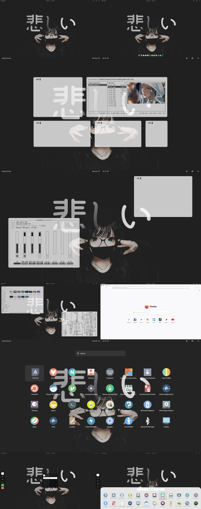

<h1 align='center'>Work in progress...</h1>

**Thanks for visiting!**

   ▴ **OS** -> [Arch](https://archlinux.org/)
   
   ▴ **WM** -> [OpenBox](https://bspwm.org/)

   ▴ **Terminal** -> [Alacritty](https://github.com/alacritty/alacritty), [ZSH](https://#)

   ▴ **Bar** -> [Polybar](https://polybar.github.io/)
   
   ▴ **Application Launcher** -> [Rofi](https://github.com/davatorium/rofi) (Modified from [here](https://github.com/adi1090x/rofi))

   ▴ **File Manager** -> [Ranger/Thunar](#)
